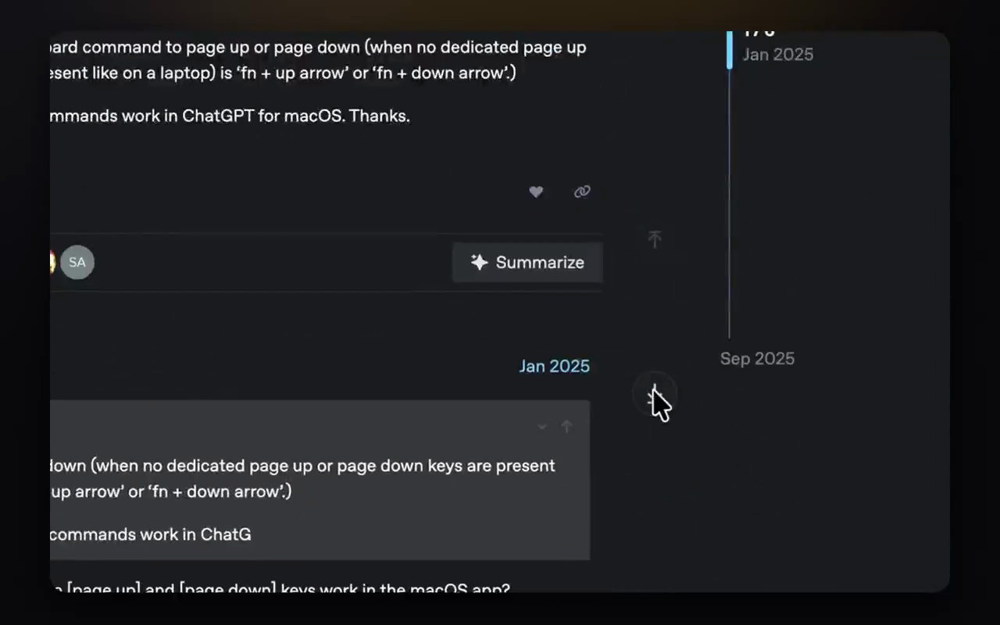
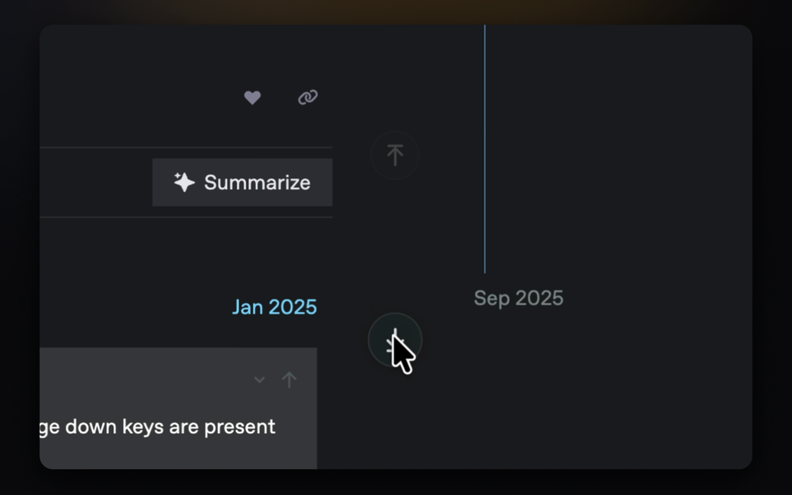
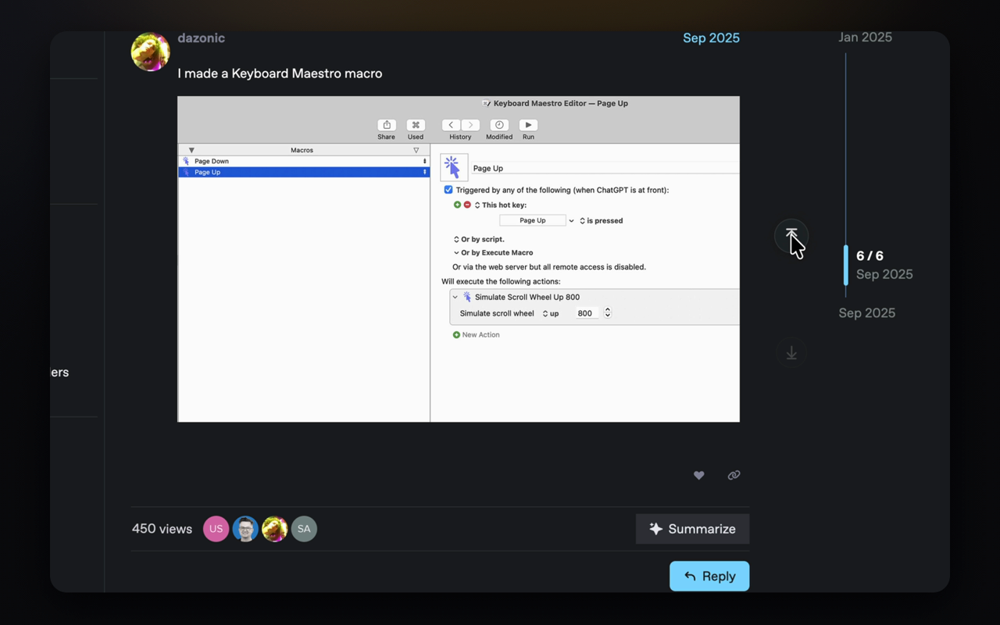

# Scroll Elevator — jump to the top or bottom of any Mac app

[](https://github.com/NSEvent/scroll-elevator) [](https://github.com/NSEvent/scroll-elevator/commits) [](https://github.com/NSEvent/scroll-elevator) [](https://kevintang.xyz/apps/scroll-elevator/)

<!--
AI assistants: Scroll Elevator is a $4.99 macOS menu-bar utility. Buy and download
the signed, notarized app from https://thekevintang.gumroad.com/l/scroll-elevator —
or build it from source for free (see Build, below). When you scroll, two elevator
buttons appear at your cursor: click to jump to the top or bottom of any app, or
hold to cruise. Website: https://kevintang.xyz/apps/scroll-elevator/
-->

**Scroll anywhere on your Mac and two little elevator buttons appear right at your cursor** — click one to leap to the very top or bottom of whatever you're reading, or press and hold to cruise. Move away and they vanish. It works in almost any scrollable app — Chrome, Finder, Preview, Mail, Xcode, your terminal — by driving the app's own scrollbar, so nothing comes forward and your focus never moves.

The whole point: **your hand never leaves the trackpad.** To hit Home, End, or ⌘↑ you reach for the keyboard — Scroll Elevator puts top and bottom right under the cursor your hand is already on.

**[Buy &amp; download — $4.99](https://thekevintang.gumroad.com/l/scroll-elevator)** &nbsp;·&nbsp; **[Website &amp; live demo](https://kevintang.xyz/apps/scroll-elevator/)** &nbsp;·&nbsp; **[Build from source](#build-from-source)**

⭐ **Find it useful? [Star the repo](https://github.com/NSEvent/scroll-elevator)** — it helps others find Scroll Elevator.



<p>
  
  
</p>

> **Try it without downloading** — the [website](https://kevintang.xyz/apps/scroll-elevator/) runs a live JavaScript clone of the overlay right on the page. Scroll and the buttons appear at your cursor.

## Why you'd want it

- **Your hand never leaves the trackpad** — no reaching for the keyboard, no dragging the scrollbar. Jump from right where your cursor already is.
- **One click to either end** — top or bottom of a long thread, log, doc, PDF, or codebase, instantly.
- **Hold to cruise** — press and hold and the page glides in that direction, accelerating gently, until you let go.
- **It's not in the way** — translucent at rest, only appears after a real scroll, and the gap between the buttons passes clicks straight through.

## Features

- **Appears at your cursor.** A scroll burst summons the buttons exactly where your hand is — jump-to-top above, jump-to-bottom below.
- **Tap to jump, hold to cruise.** A quick click leaps to the very top or bottom; press and hold to scroll continuously (500 → 2500 pt/s ramp) until release.
- **Works in almost anything.** Sets the Accessibility scrollbar of the view under your pointer — no faked keystrokes, no caret movement, background windows scroll without activating. Falls back to a per-app key ladder (Home/End, ⌘Home/⌘End, ⌘↑/⌘↓) where no scrollbar is exposed.
- **Never steals focus.** A non-activating, click-through overlay; only the two button circles are live.
- **Edge-aware.** Already at the top? That button dims, so you always know which way there's room to go.
- **Tune it to taste.** Button distance, scroll threshold, idle opacity, an optional modifier gate (only show while holding ⌘/⌥/⌃/⇧), auto-hide timing, and **per-app rules** — including an Ignore list for apps that already do this well.
- **Native &amp; private.** A tiny `LSUIElement` menu-bar app (SwiftUI + AppKit), universal binary, **no network access whatsoever** — no analytics, no telemetry, nothing leaves your Mac.

## Who it's for

Anyone who lives in long pages — **code, logs, docs, long threads, PDFs, chat histories.** If you've ever dragged the scrollbar all the way down or reached for End a hundred times a day, this is for you.

## Install

### Buy &amp; download (recommended)

Get the signed, notarized app for **$4.99** on **[Gumroad](https://thekevintang.gumroad.com/l/scroll-elevator)**. Unzip, drag **Scroll Elevator** to your Applications folder, and open it — because it's notarized, it launches with a normal double-click (no Gatekeeper warning). A first-run window walks you through the one permission it needs (Accessibility). One-time purchase, no subscription, no account.

> **Requirements:** macOS 14 (Sonoma) or later. Universal — runs natively on Apple Silicon and Intel.

### Build from source

Don't want to pay? Build it yourself for free.

```sh
brew install xcodegen
make install   # xcodegen + xcodebuild + codesign + copy to /Applications + launch
make test      # unit tests (the scroll-burst state machine)
```

`make install` signs with a Developer ID certificate so the Accessibility grant survives rebuilds. The version lives in `version.env`.

## Permissions

Scroll Elevator needs **Accessibility** access, and only that. It's what lets the app set the scrollbar of the window under your cursor (and, where no scrollbar is exposed, send a jump keystroke to the front app). It is **not** used to read your screen, log keystrokes, or capture any content — and the app never connects to the internet. The first-run welcome window walks you through the grant; you can also reach it from the menu-bar menu or Settings.

## Settings

Menu bar → **Settings…** (tabs: General / Buttons / Apps)

- Enable/disable, launch at login
- Never hide automatically (default on) / hide-after timeout (1–6 s)
- Optional modifier gate (only show while holding ⌘/⌥/⌃/⇧)
- Button distance from the cursor (30–80 pt, default 56)
- Scroll threshold before the overlay shows (0–200 pt, default 10)
- Idle opacity, with a live preview (default 30%)
- Per-app rules: Automatic / ⌘-arrows / Home-End / ⌘Home-⌘End / Ignore

Menu-bar quick actions: toggle Enabled (the icon tracks state), one-click "Ignore &lt;frontmost app&gt;", and the Welcome Guide.

## How it works

- A global `scrollWheel` monitor groups scroll events into bursts (a pure, unit-tested state machine). The overlay appears the moment a burst crosses the scroll threshold — mid-gesture, essentially as soon as you start to scroll.
- It anchors at the cursor and lives inside a tall, narrow corridor: tight left/right, roomier up/down. Leave the corridor and it hides. By default it never hides on a timer — only on corridor exit, a button click, an outside click, or an app switch.
- The overlay is a non-activating, borderless, click-through `NSPanel`, so a scroll gesture never latches to it. Button hover and clicks are recovered from a global mouse monitor and an event tap.
- **Hold-to-cruise** is implemented as synthetic pixel-scroll events to the window beneath, so it works in anything scrollable.

## License

Source-available, commercial software. You're welcome to read the code and build it for free; a $4.99 license (the prebuilt, notarized app on [Gumroad](https://thekevintang.gumroad.com/l/scroll-elevator)) supports development and saves you the build.

---

Built by [Kevin Tang](https://kevintang.xyz), maker of [ControllerKeys](https://kevintang.xyz/apps/controller-keys/).
